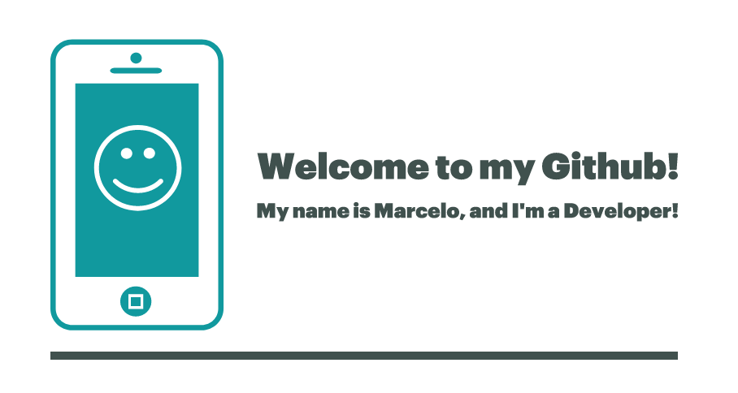

<h1> Hey! Nice to see you 👋!!!</h1>

  

  

<h2>⚡️ A Few Quick Facts</h2>
<ul>
<li>Meu Primeiro Contato com Programção foi no RPG Maker e no Mugen na adolescência, adorava replicar técnicas que aprendia nos foruns;</li>
<li>Cheguei a estudar python no codeacademy em 2015, mas só tomei a decisão de embarcar de fato em 2021;</li>
<li>Sou formado em administração e trabalhei boa parte da minha vida com ela, e claro que brinquei muito com excel;</li>
<li>Curto bastante jogos retro, mobas, rts;</li>
<li>Tb gosto bastante de história militar</li>
<li> Acabei de terminar o curso devinhouse do senai e estou iniciando alguns outros como RocketSeat, Fullcycle, desenvolvedor.io </li>
<li> Tenho grande interesse em aprender várias techs diferentes, não me apego a tecnologias. Pode me chamar de programador asterisco 😂.</li>
<li>Me considero uma pessoa bem comunicativa, bem amigável, sou bem criativo e caprichoso!</li> 
</ul>

<h2>📌 Projects</h2>

<table>
  <thead align="center">
    <tr border: none;>
      <td><b> Data</b></td>
      <td><b> Projeto</b></td>
      <td><b> Descrição</b></td>
      <td><b> Technologias</b></td>
    </tr>
  </thead>
  <tbody>
    <tr>
      <td> Queque</td>
      <td><a href="https://github.com/thmsgbrt/react-simple-pull-to-refresh"><b>Queque</b></a></td>
      <td>Queque</td>
      <td>Queque</td>
  </td>
    </tr>
       <tr>
     <td> Queque</td>
      <td><a href="https://github.com/thmsgbrt/react-simple-pull-to-refresh"><b>Queque</b></a></td>
      <td>Queque</td>
      <td>Queque</td>
  </td>
    </tr>
    
   </table>

<h2>✒️ Recent Posts</h2>
<ul>
<li><a target="_blank" href="https://www.google.com/">Em Breve ⛏</a></li>
</ul>

<h2>✨ Techs</h2>

  
  
  
  
  
  

<h3 align="left">Connect with me:</h3>

  

