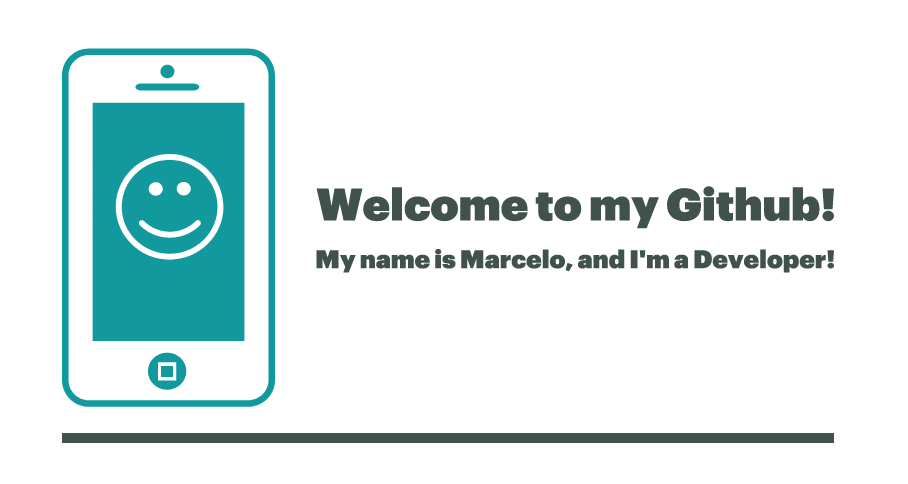

<h1> Hey! Nice to see you 👋!!!</h1>

  

  

<h2>⚡️ A Few Quick Facts</h2>
<ul>
<li> Meu Primeiro Contato com Programção foi no RPG Maker e no Mugen na adolescência, adorava replicar técnicas que aprendia nos foruns;</li>
<li> Cheguei a estudar python no codeacademy em 2015, node e react em 2022;</li>
<li> Sou formado em administração e trabalhei toda  minha vida como empreendedor;</li>
</ul>

